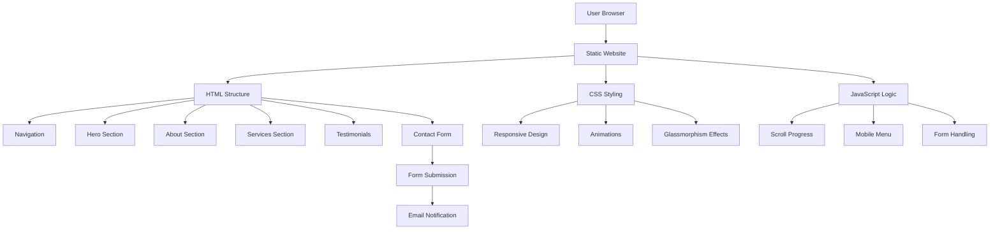
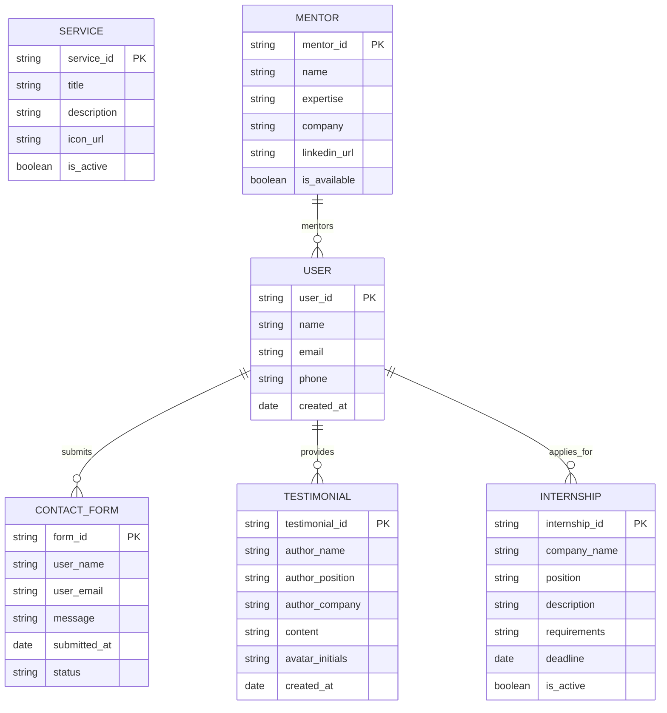

# Beyond Career - Career Guidance Platform

## Project Overview

Beyond Career is a modern, responsive career guidance platform designed to empower students from IIT Kharagpur and beyond. The platform offers career counseling, internship opportunities, mentorship programs, and community engagement through an intuitive and visually stunning interface.

## Features

- **Modern UI/UX**: Glassmorphism design with smooth animations
- **Fully Responsive**: Optimized for all devices and screen sizes
- **Performance Optimized**: Fast loading with minimal JavaScript
- **Interactive Elements**: Hover effects, floating animations, scroll indicators
- **Contact Form**: Integrated contact system for user inquiries
- **Success Stories**: Testimonial section showcasing user achievements

## System Architecture



## Entity Relationship Diagram



## Technology Stack

| Technology | Purpose | Version |
|------------|---------|---------|
| HTML5 | Structure & Semantics | Latest |
| CSS3 | Styling & Animations | Latest |
| JavaScript | Interactivity | ES6+ |
| Google Fonts | Typography | Inter Font Family |

## Project Structure

```
beyond-career/
│
├── index.html              # Main HTML file with embedded CSS/JS
├── README.md               # Project documentation
├── assets/                 # Static assets (if separated)
│   ├── images/
│   ├── icons/
│   └── fonts/
├── docs/                   # Documentation files
│   ├── design-rationale.md
│   ├── technical-docs.md
│   └── deployment-guide.md
└── .gitignore             # Git ignore file
```

## Quick Start Guide

### Prerequisites

- A modern web browser (Chrome, Firefox, Safari, Edge)
- Text editor (VS Code, Sublime Text, etc.)
- Git (for version control)
- Live server extension (for development)

### Installation Steps

1. **Clone the Repository**
   ```bash
   git clone https://github.com/ravikirank2018/Beyond-Career
   ```

2. **Open in Browser**
   ```bash
   # Option 1: Direct file opening
   open index.html
   
   # Option 2: Using Python (if installed)
   python -m http.server 8000
   
   # Option 3: Using Node.js (if installed)
   npx serve .
   ```

3. **Development Setup**
   ```bash
   # Install Live Server extension in VS Code
   # Or use any local development server
   ```

## Deployment Guide

### Method 1: Netlify (Recommended)

1. **Create Netlify Account**
   - Visit [netlify.com](https://netlify.com)
   - Sign up with GitHub/GitLab

2. **Deploy from Git**
   ```bash
   # Push your code to GitHub
   git add .
   git commit -m "Initial commit"
   git push origin main
   ```

3. **Connect Repository**
   - New site from Git
   - Choose your repository
   - Deploy settings: Build command: (leave empty), Publish directory: (leave empty)

4. **Custom Domain (Optional)**
   - Domain settings → Add custom domain

### Method 2: Vercel

1. **Install Vercel CLI**
   ```bash
   npm i -g vercel
   ```

2. **Deploy**
   ```bash
   vercel --prod
   ```

### Method 3: GitHub Pages

1. **Enable GitHub Pages**
   - Repository Settings → Pages
   - Source: Deploy from branch
   - Branch: main

2. **Access Site**
   - URL: `https://ravikirank2018.github.io/Beyond-Career/`

## Customization Guide

### Color Scheme

```css
:root {
    --primary-gradient: linear-gradient(135deg, #667eea 0%, #764ba2 100%);
    --secondary-gradient: linear-gradient(135deg, #f093fb 0%, #f5576c 100%);
    --accent-gradient: linear-gradient(135deg, #4facfe 0%, #00f2fe 100%);
    --dark-gradient: linear-gradient(135deg, #1a1a2e 0%, #16213e 100%);
}
```

### Typography

```css
/* Import Google Fonts */
@import url('https://fonts.googleapis.com/css2?family=Inter:wght@300;400;500;600;700;800&display=swap');

body {
    font-family: 'Inter', sans-serif;
}
```

## Performance Metrics

- **First Contentful Paint**: < 1.5s
- **Largest Contentful Paint**: < 2.5s
- **Cumulative Layout Shift**: < 0.1
- **Time to Interactive**: < 3.5s
- **SEO Score**: 95+

## Development Tools

### Recommended Extensions (VS Code)

- Live Server
- Auto Rename Tag
- CSS Peek
- HTML CSS Support
- Prettier
- GitLens

### Debugging Tools

```javascript
// Enable scroll progress debugging
console.log('Scroll Progress:', scrolled + '%');

// Form submission debugging
console.log('Form submitted:', formData);
```

## Troubleshooting

### Common Issues

1. **Fonts not loading**
   ```html
   <!-- Ensure preconnect is added -->
   <link rel="preconnect" href="https://fonts.googleapis.com">
   <link rel="preconnect" href="https://fonts.gstatic.com" crossorigin>
   ```

2. **Animations not working**
   ```css
   /* Check browser support for backdrop-filter */
   backdrop-filter: blur(20px);
   -webkit-backdrop-filter: blur(20px); /* Safari fallback */
   ```

3. **Mobile menu not toggling**
   ```javascript
   // Ensure JavaScript is loaded
   document.addEventListener('DOMContentLoaded', function() {
       // Menu toggle code here
   });
   ```

## Future Enhancements

- Backend integration for contact form
- User authentication system
- Dynamic content management
- Advanced search functionality
- Multi-language support
- Dark/Light theme toggle
- Progressive Web App (PWA) features

## Contributing

1. Fork the repository
2. Create feature branch (`git checkout -b feature/AmazingFeature`)
3. Commit changes (`git commit -m 'Add AmazingFeature'`)
4. Push to branch (`git push origin feature/AmazingFeature`)
5. Open Pull Request
